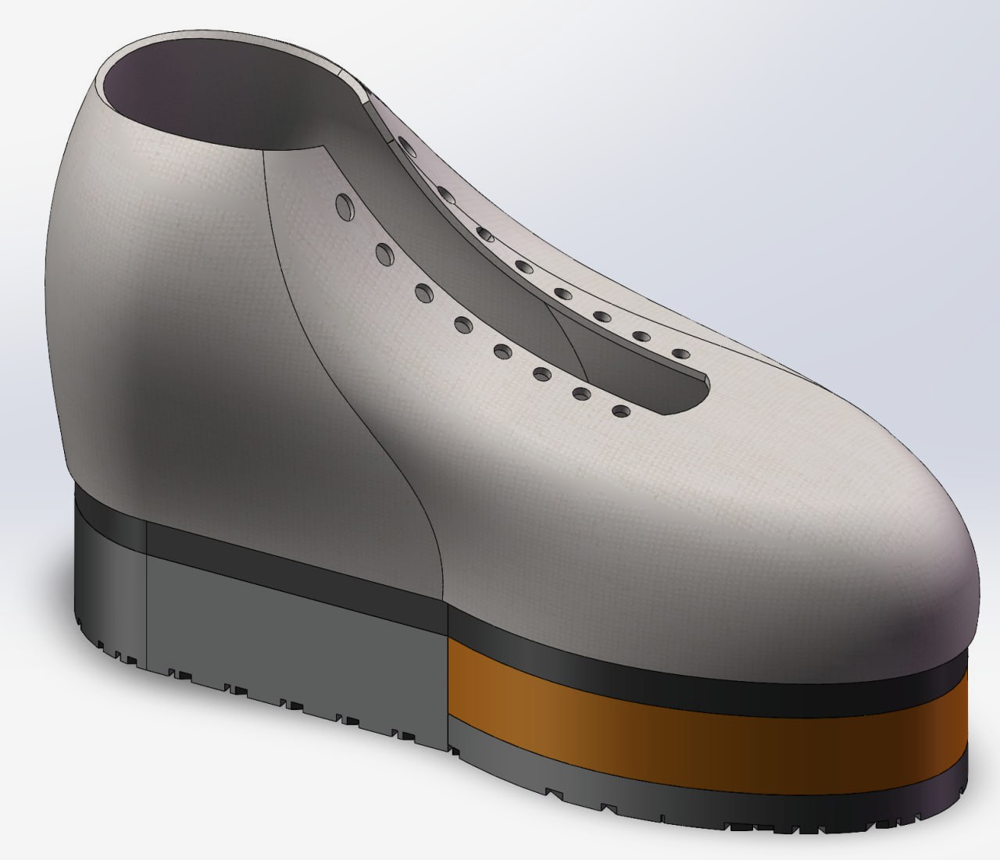
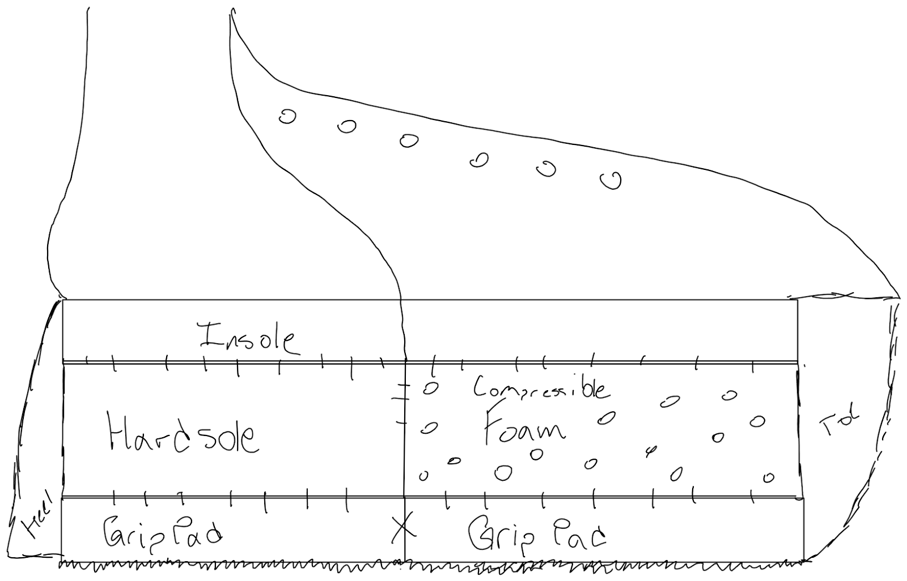
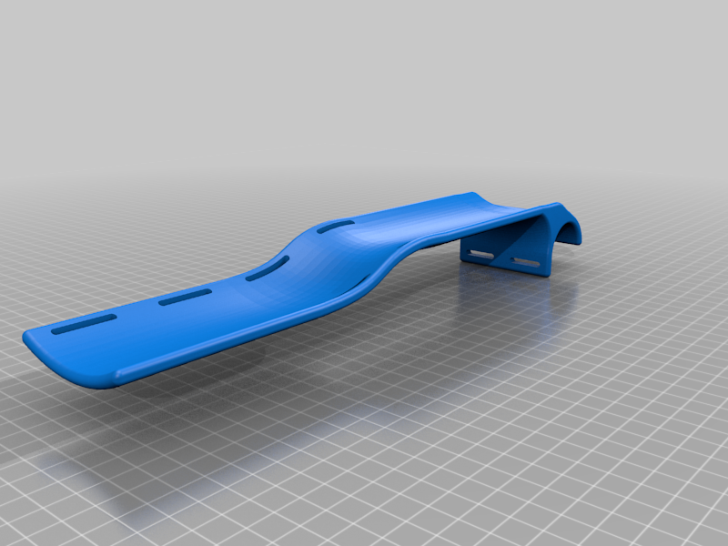

## Flexi-Foot (Junior Design)

Team design project focused on post-operative footwear for Hallux Rigidus fusion patients during forefoot off-loading.

- **My contributions:** led CAD in SolidWorks and authored the technical summary in the final design report.
- **Design intent:** combine reverse-camber offloading with improved stability and comfort seen in flatter post-op shoe designs.

## Clinical Problem

The project addressed discomfort and imbalance during the partial weight-bearing period (commonly 6–8 weeks) after forefoot surgery. Existing options often force a tradeoff between forefoot force reduction and gait stability.

## Technical Design Decisions

- Built a reverse-camber inspired geometry with increased forefoot support through a soft insert.
- Used **surface modeling** for the upper/top profile to achieve a more shoe-like form while preserving functional offloading geometry.
- Implemented **different insole/insert materials** in the forefoot region, selecting open-cell polyurethane foam (PORON-type) for compressibility and pressure reduction.
- Combined soft forefoot material with tougher outsole regions to improve traction and perceived stability.
- Included a lightly connected front/back outsole transition to minimize unintended upward force during gait.

## Key Details from the Report

- Needs statement centered on preserving mobility while reducing discomfort and imbalance in Hallux Rigidus post-op recovery.
- Decision matrix prioritized forefoot force reduction, stability, and comfort; this drove selection of the final concept direction.
- The CAD prototype was dimensioned around a men’s size 10 baseline and designed for straightforward scaling to other sizes.
- Documented limitations included foam lifespan/compression wear and gait mismatch due to sole-height asymmetry.

## Visuals

Additional design artifacts:
- [Cross section](../../assets/img/foot/FootCrossSection.png)
- [Technical drawing](../../assets/img/foot/drawingfoot.png)
- [Decision matrix](../../assets/img/foot/decisionmatrixfoot.png)
- [Designed solution](../../assets/img/foot/designed%20solution.png)

## GRiP Bike Prosthetics (Mentorship & Delivery)

In GRiP, I helped lead a team of 8 students to design and deliver three bike prosthetics for patients so they could return to riding. I owned major CAD development and worked with students through build iteration, fit checks, and practical handoff planning. The project emphasized both technical execution and mentorship: translating patient-specific needs into manufacturable parts, guiding younger students through design decisions, and keeping the team aligned from concept to delivery.

## GRiP Visuals

A second photo showing the recipient receiving or using the prosthetic on a bike is strongly recommended here because it demonstrates real-world impact alongside the technical build.

## Report

- [Published design report](https://docs.google.com/document/d/e/2PACX-1vSX4wGHBFULdQ-eV5-Lt659iFwe6qvSnGEcsRR_wUkzhKMZdgCmyTeYJOZDCoQ9tg/pub)
