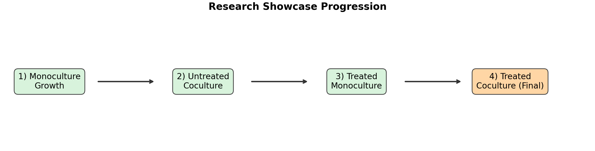
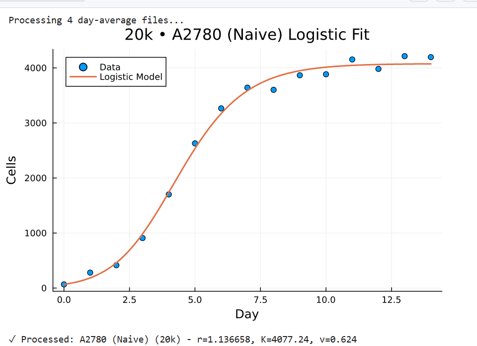
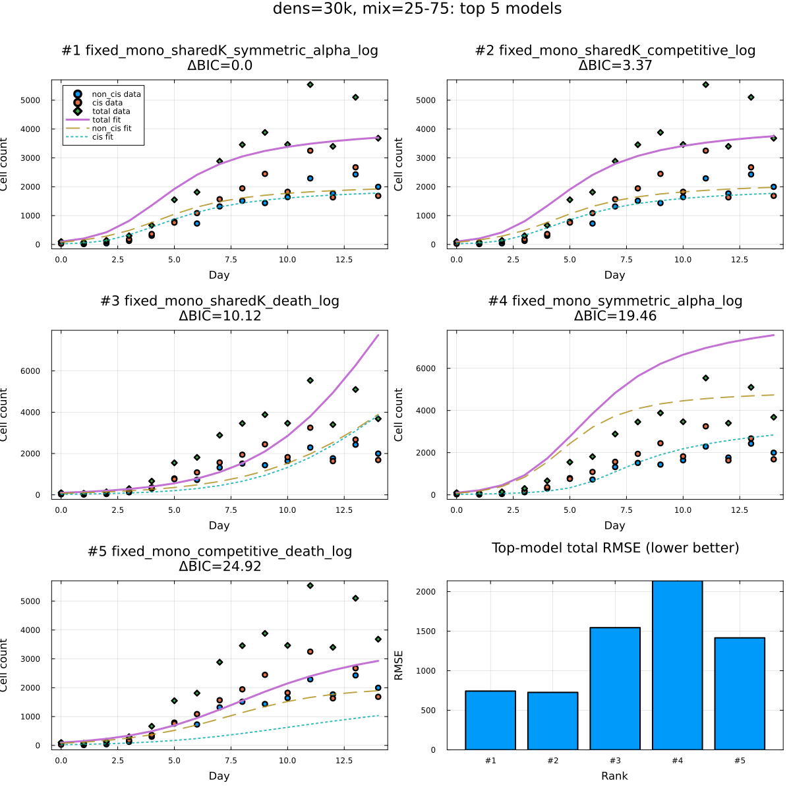
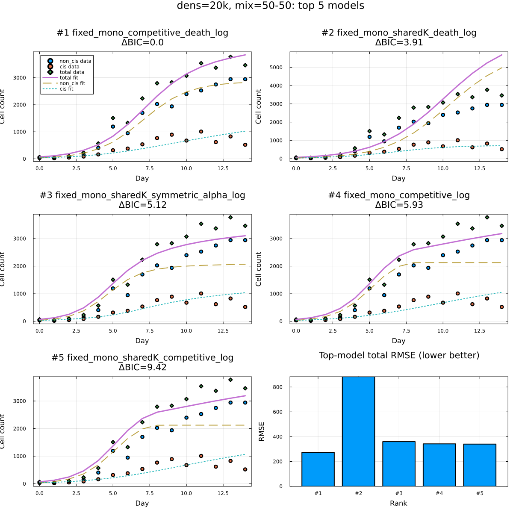
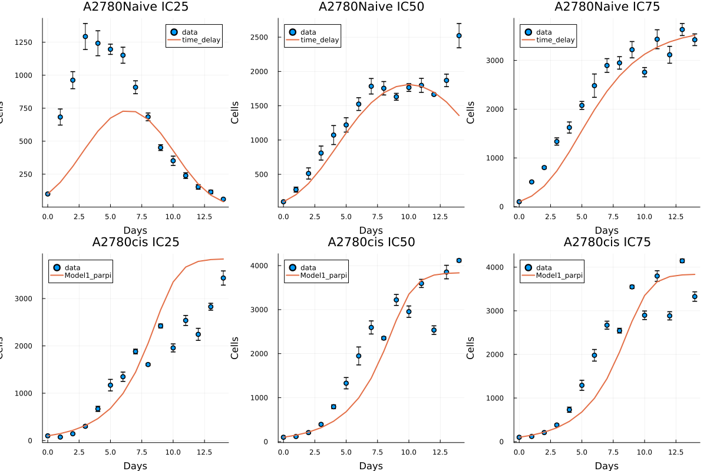
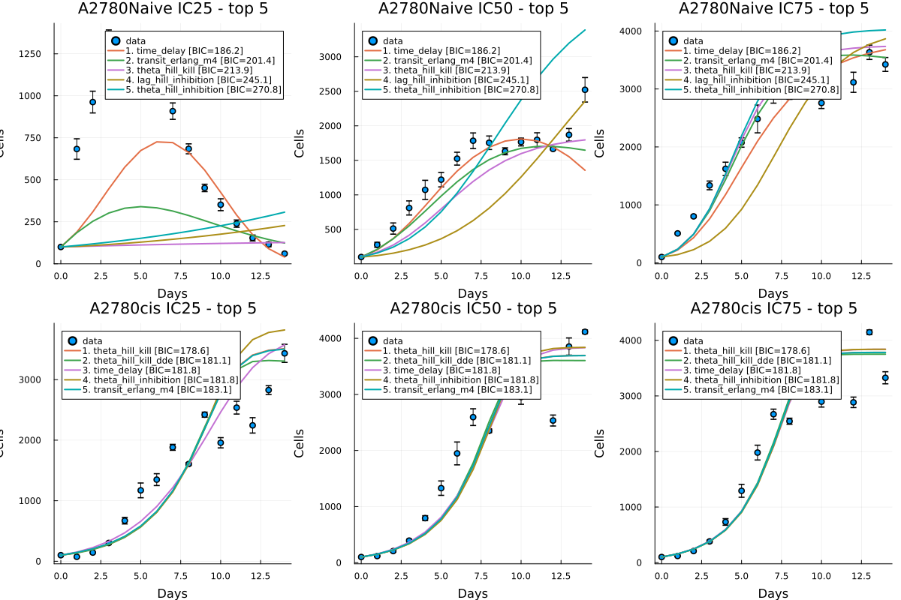

## Research Context

**PI:** Dr. Ferrall-Fairbanks  
**Lab:** BEAT Cancer Lab  
**Department:** Crayton J. Pruitt Department for Biomedical Engineering  
**Graduate Assistant Mentor:** Adriana Del Pino Herrera

This project is one of my core research efforts in the BEAT Cancer Lab and serves as the mathematical-modeling arm of that work.

---

## Problem and Motivation

Cancer populations change growth behavior under different environmental and treatment conditions. Raw time-series cell counts capture these trends, but they do not directly identify the parameters governing proliferation, crowding effects, or competition. This project builds a reproducible ODE-based fitting workflow to estimate interpretable parameters across monoculture and coculture systems.

---

## Modeling Framework

General workflow:

1. Load experimental datasets.
2. Select model structure (monoculture or coculture).
3. Solve ODE systems numerically.
4. Fit parameters with least-squares optimization.
5. Evaluate fit quality with SSE, AIC, and BIC.
6. Export fitted parameters for cross-condition comparison.

*Figure 1: Progression used in this showcase, ending with treated coculture as the final integration stage.*

---

## 1) Untreated Monoculture Growth

Untreated monoculture growth was compared with standard logistic and theta-logistic forms.

Standard logistic:

$$
\frac{dN}{dt} = rN\left(1-\frac{N}{K}\right)
$$

Theta-logistic (generalized logistic):

$$
\frac{dN}{dt} = rN\left(1-\left(\frac{N}{K}\right)^v\right)
$$

Interpretation:
- `N(t)` is the cell count at time `t`.
- Growth is approximately exponential when `N` is small.
- Growth slows as `N` approaches `K`.
- `v` controls curvature/strength of density dependence.
- `v = 1` reduces theta-logistic to standard logistic.

Parameter definitions:
- `r`: intrinsic growth rate (day^-1)
- `K`: carrying capacity (cells)
- `v`: shape/curvature parameter for density dependence (theta-logistic only)

Model-selection note (from `monoculture_model_bic_results.csv`):
- Naive monoculture: standard logistic had slightly lower BIC than theta-logistic (`321.28` vs `322.58`).
- Resistant monoculture: theta-logistic had much lower BIC than standard logistic (`405.62` vs `441.83`), indicating better fit for resistant growth geometry.

*Figure 2: Untreated monoculture logistic-fit example (data vs fitted curve).*

*Figure 3: Resistant untreated monoculture fit, where theta-logistic form improved BIC relative to standard logistic.*

---

## 2) Untreated Coculture

Untreated coculture experiments were used to estimate interaction behavior between sensitive and resistant populations under shared-resource conditions.

Model equations:

$$
\frac{dS}{dt} = r_S S\left(1-\frac{S + \alpha_{SR}R}{K}\right)
$$

$$
\frac{dR}{dt} = r_R R\left(1-\frac{R + \alpha_{RS}S}{K}\right)
$$

Interpretation:
- Sensitive (`S`) and resistant (`R`) populations both grow under density limits.
- Competition coefficients (`aSR`, `aRS`) encode how strongly one population suppresses the other.
- Asymmetry in `aSR` vs `aRS` quantifies ecological advantage.

Parameter definitions:
- `S(t)`: sensitive population count
- `R(t)`: resistant population count
- `rS`, `rR`: intrinsic growth rates
- `K`: shared carrying capacity
- `aSR`: effect of resistant cells on sensitive growth
- `aRS`: effect of sensitive cells on resistant growth

*Figure 4: Untreated coculture model panels (30k, 25/75 composition).*

*Figure 5: Untreated coculture model panels (20k, 50/50 composition).*

---

## 3) Treated Monoculture

Treated monoculture was modeled using a multi-compartment drug-response formulation to capture delayed effects and state transitions.

Model equations:

$$
\frac{dS}{dt} = rS\left(1-\frac{S+\sum_i C_i}{K}\right)-kS
$$

$$
\frac{dC_1}{dt} = kS-kC_1,\quad
\frac{dC_2}{dt} = kC_1-kC_2,\quad
\ldots,\quad
\frac{dC_n}{dt} = kC_{n-1}-dC_n
$$

$$
N_{\text{total}} = S+\sum_i C_i
$$

Interpretation:
- Cells transition from proliferative to drug-affected states.
- Intermediate compartments capture delayed treatment effects.
- Terminal compartment includes death/removal through `d`.

Parameter definitions:
- `S(t)`: proliferative sensitive cells
- `Ci(t)`: treated/damaged compartment `i`
- `r`: intrinsic growth rate
- `K`: carrying capacity
- `k`: drug-induced transition rate between states
- `d`: terminal death rate

*Figure 6: Best treated-monoculture fit grid (30k condition).*

*Figure 7: Top treated-monoculture model comparison grid (30k condition).*

---

## 4) Treated Coculture (Final Stage)

Treated coculture is the final stage because it combines treatment effects with ecological competition dynamics in the same system. This stage is where adaptive-therapy hypotheses can be tested directly under treatment pressure and mixed-population interaction.

Conceptual treated-coculture form:

$$
\frac{dS}{dt} = r_S S\left(1-\frac{S+\alpha_{SR}R}{K}\right)-k_S S
$$

$$
\frac{dR}{dt} = r_R R\left(1-\frac{R+\alpha_{RS}S}{K}\right)-k_R R
$$

Extended treated-state compartments can be added per population to model delayed response and recovery dynamics.

Additional parameter definitions:
- `kS`, `kR`: treatment-effect transition rates for sensitive/resistant populations

Current page structure is now set so treated-coculture figures can be dropped in as the final results section as soon as that dataset/plot is added.

---

## Impact

This workflow converts experimental growth curves into interpretable parameters that can be compared across conditions. It supports reproducible analysis from monoculture baseline fitting through coculture interaction modeling, with treated coculture as the final decision-relevant integration step.
