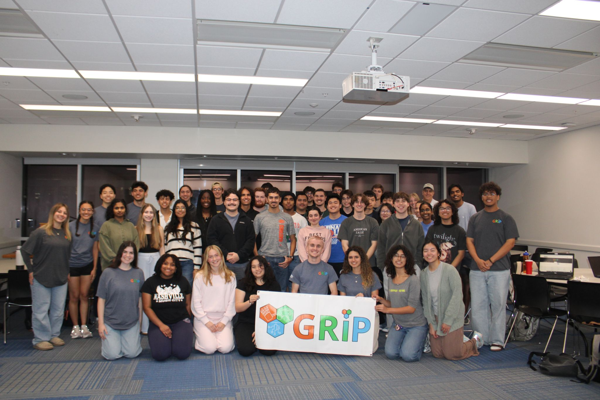
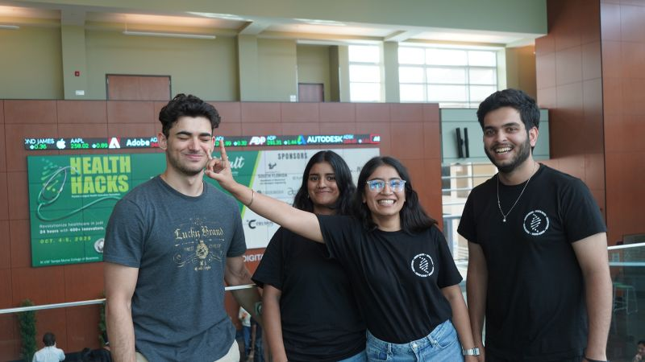

## Leadership & Service

My leadership and service experiences have centered on sustained responsibility for people, projects, and continuity rather than one-time achievements. The work below reflects long-term engagement in service contexts where safety, communication, and follow-through matter as much as technical correctness.

---

## GRiP — Pediatric Assistive Device Program

### Clinical & Human Context
Children with disabilities often require highly individualized assistive devices that are not readily available through commercial or insurance-supported pathways. GRiP addresses this gap by partnering directly with families to design and build custom assistive solutions, emphasizing usability, safety, and long-term support rather than one-off prototyping.

Many projects extend across semesters, requiring intentional continuity planning to ensure families are not affected by student turnover.

---

### My Role & Scope of Responsibility
As **Vice President**, I was responsible for the operational integrity of the organization and for ensuring that commitments made to families were fulfilled responsibly.

My responsibilities included:
- Serving as the primary point of project intake and approval for a semester in which approximately **45 projects** were accepted
- Overseeing workflows for onboarding, team assignment, and project tracking
- Ensuring continuity when teams or leadership transitioned
- Working with the President to make final go/no-go decisions regarding device delivery
- Increasing organizational scope and effectiveness while maintaining trust with recipient families

This role required balancing growth with restraint, and deciding when to slow down or pause work to preserve quality and safety.

---

### Leadership Challenges
Scaling a service organization that works with vulnerable populations introduced challenges similar to those seen in healthcare systems:
- Projects risked stalling when students graduated or changed roles
- Documentation quality varied, threatening continuity
- Organizational changes sometimes caused short-term frustration despite long-term benefit
- Expectations needed to be managed carefully to avoid overpromising to families

Addressing these challenges required clear communication, transparency, and a willingness to take responsibility for difficult decisions.

---

### Mentorship & Team Development
A significant part of my leadership involved **direct mentorship**, particularly for first-year students and newer members entering a complex, multidisciplinary environment.

I led the formation of project teams and event committees, helping members understand not only *what* tasks needed to be done, but *why* they mattered and how to translate ambiguous goals into concrete next steps. This included mentoring teams on:
- Breaking open-ended problems into actionable task lists
- Defining realistic short-term milestones
- Reassessing direction when initial plans failed
- Communicating progress and uncertainty clearly

Beyond formal team leadership, I mentored multiple students individually. Some sought guidance after developing an interest in assistive technology or service-based engineering, while others required structured support as they learned to navigate responsibility and leadership. Over time, several students I mentored transitioned into leadership roles themselves.

This experience reinforced that mentorship carries responsibility: shaping not only outcomes, but how others learn to think, communicate, and take ownership—paralleling the teaching and supervisory roles physicians hold with trainees and interdisciplinary teams.

---

### Operational Infrastructure & Continuity Systems
To address continuity and accountability challenges, I **designed and implemented internal operational infrastructure** supporting the full lifecycle of GRiP membership and projects.

These systems were created to:
- Standardize onboarding and training
- Track team assignments and project history
- Preserve institutional knowledge across semesters
- Maintain clear records of participation, preferences, and responsibilities

Design decisions prioritized **clarity, auditability, and ease of use** over technical novelty, reflecting the responsibility of supporting pediatric assistive device work where miscommunication or lost information could directly affect families.

I initially served as the primary maintainer and am now transitioning ownership by mentoring others on architectural decisions and long-term system challenges.

---

### Safety, Ethics, and Delivery Boundaries
GRiP does not deliver unfinished or unsafe devices.

If a project is not ready or does not meet safety expectations, it is not delivered. Decisions regarding delivery are made jointly by the President and Vice President in coordination with the recipient coordinator.

When limitations or delays arise:
- Constraints are communicated explicitly
- Expectations are clarified with families
- Projects are paused or re-scoped rather than rushed

This approach emphasized ethical boundaries, transparency, and prioritizing safety over timelines.

---

### Interaction with Families & Clinical Advisors
I interact directly with families as a representative of the organization and have worked closely with families on individual projects. GRiP projects are advised by occupational therapists, nurses, engineers, and faculty mentors, and I am particularly involved in communication with occupational therapists to ensure that devices align with functional needs and real-world use.

This role required translating technical decisions into accessible language and respecting the lived experience of families.

---

## Leadership Event Exhibits

### GRiP Designathon

**Role:** Organizer / Lead  
**Scale:** 45 participants, 15 project submissions.  
**Outcome:** 15 recipient-focused device concepts; about half are in follow-up toward completed recipient projects.

**Problem**  
Real recipient cases were available, but students needed a structured pathway to translate cases into actionable project work.

**Execution**  
Built the event from concept to delivery: case organization, participant communication, DevPost setup, logistics, judging, and follow-up pipeline.

**Impact**  
Created a repeatable annual model that converts student design work into recipient-impacting project pipelines.

**Sponsors and Winners**  
- Sponsors: UF Biomedical Engineering (1st prize), Medtronic ENT (2nd prize), Gainesville Hackerspace (3rd prize).  
- Winners: 1st Twilight Team (Cerebral Palsy Motor Skills Toy), 2nd Bionic Blue (Adaptable Paint Brush), 3rd Joint Venture (Magnetic Writing Guidance Board).

Link: https://www.linkedin.com/posts/kadin-el-bakkouri-09531b289_adaptivedesign-assistivetechnology-biomedicalengineering-activity-7430400806060990464-g7a7?utm_source=share&utm_medium=member_desktop&rcm=ACoAAEX-D7EBRFHp4z_-NMMPOMmJ6LZK6-ok7NQ

---

### HealthHacks

**Role:** Organizer / Lead  
**Scale:** Multi-university collaboration (UF + USF) with hardware prototyping, judging, and overnight sprint execution.  
**Outcome:** Delivered judged prototype pitches and cross-university project execution supported by shared hardware/resources.

**Problem**  
Cross-disciplinary healthcare ideas needed focused build time, rapid prototyping resources, and execution structure.

**Execution**  
Organized participant and hardware logistics, contracts/collaborations, judging support, and hardware checkout while coordinating partner teams.

**Impact**  
Strengthened inter-institution innovation pathways and produced practical health-tech concepts under real constraints.

Link: https://www.linkedin.com/posts/kadin-el-bakkouri-09531b289_innovation-biomedicalengineering-grip-activity-7382535412101152768-9i7X?utm_source=share&utm_medium=member_desktop&rcm=ACoAAEX-D7EBRFHp4z_-NMMPOMmJ6LZK6-ok7NQ

---

### What This Taught Me About Medicine
This leadership experience reshaped how I think about responsibility and care delivery:
- Systems matter as much as individual effort
- Continuity is a form of care
- Safety often means saying “not yet”
- Mentorship is inseparable from responsibility
- Clear communication prevents harm

These lessons strongly inform my interest in medicine, particularly in environments where multidisciplinary teams, uncertainty, and long-term responsibility are central.
