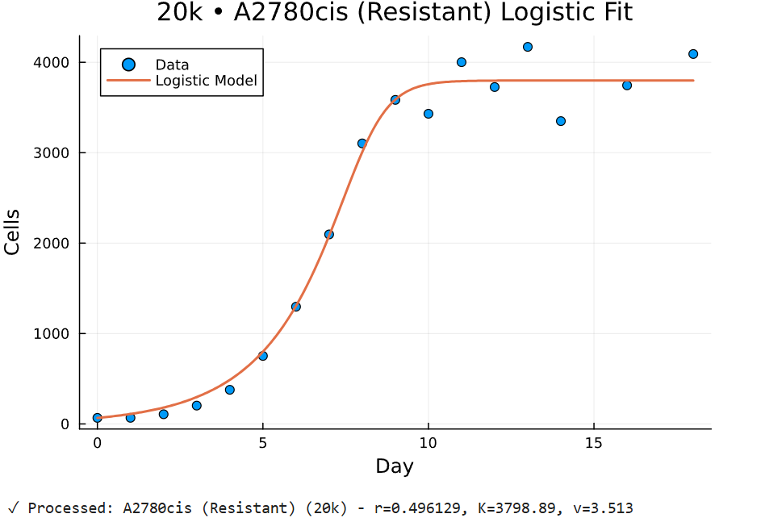
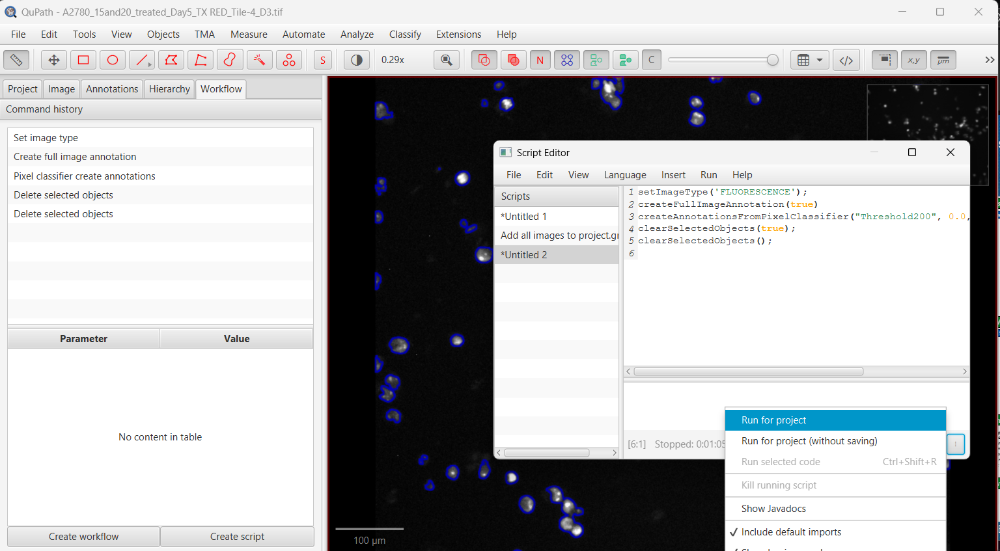

# Research

This section highlights completed research work and reproducible analysis pipelines.

<section class="research-preview placard reveal">
	
	

		<h2>Disease &amp; Treatment Modeling</h2>
		
<strong>PI:</strong> Dr. Ferrall-Fairbanks 
		<strong>Lab:</strong> BEAT Cancer Lab 
		<strong>Department:</strong> Crayton J. Pruitt Department for Biomedical Engineering 
		<strong>Graduate Assistant Mentor:</strong> Adriana Del Pino Herrera

		
This project focuses on mathematical modeling of ovarian cancer population dynamics, with an emphasis on interpretable growth behavior, treatment response, and adaptive-therapy framing. The work turns experimental cell-growth measurements into parameterized ODE models that can be compared across monoculture and coculture conditions.

		
My responsibilities centered on building the fitting workflow, organizing the model-comparison pipeline, and interpreting how the fitted parameters changed across experimental settings. That included preparing visual outputs, comparing model forms with information criteria, and structuring the analysis so it could support future treated coculture work.

		
<a href="/projects/disease-treatment-modeling/">Open Disease &amp; Treatment Modeling</a>

	

</section>

<section class="research-preview placard reveal">
	
	

		<h2>QuPath Cell Count Pipeline</h2>
		
<strong>PI:</strong> Dr. Ferrall-Fairbanks 
		<strong>Lab:</strong> BEAT Cancer Lab 
		<strong>Department:</strong> Crayton J. Pruitt Department for Biomedical Engineering 
		<strong>Graduate Assistant Mentor:</strong> Adriana Del Pino Herrera

		
This project focuses on research-enabling histology analysis infrastructure. The pipeline standardizes large-batch image ingestion, cell detection, and export so experimental datasets can move into downstream analysis without the speed and consistency limits of manual counting.

		
My responsibilities included building and refining the QuPath workflow, setting up consistent naming and export behavior, and structuring the process so quality-control review stayed possible even at larger batch sizes. The result was a more reproducible path from image folders to analysis-ready quantitative outputs.

		
<a href="/projects/qupath-cell-count-pipeline/">Open QuPath Cell Count Pipeline</a>

	

</section>
