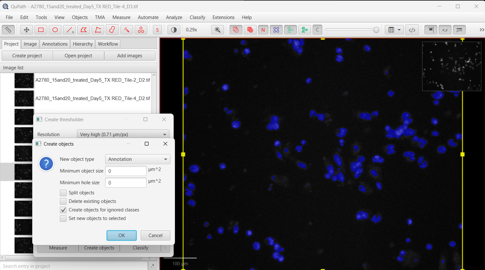
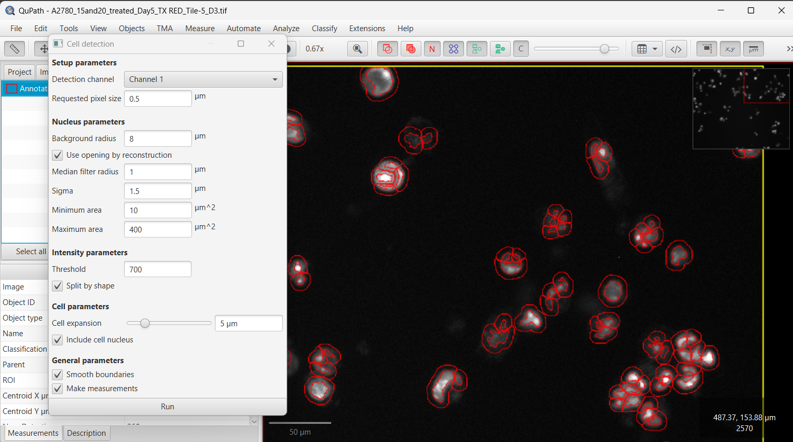
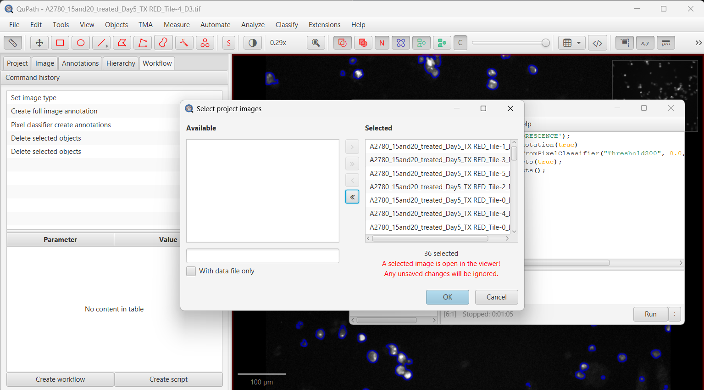
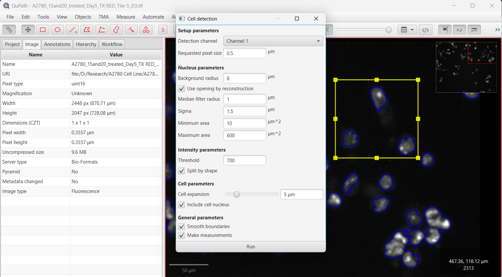

## Clinical/Research Need

Manual cell counting across large histology datasets was too time-intensive and inconsistent for reliable translational analysis. The objective was to automatically ingest full image folders, run standardized counting, and generate outputs ready for later analysis with minimal manual preprocessing.

## Pipeline Overview

This workflow uses QuPath scripting and batch execution to standardize image ingestion, detection, and export:

1. Recursively load all images from a selected root folder, including nested subfolders.
2. Use consistent naming conventions to map samples and reduce preprocessing effort.
3. Run tissue/cell detection with fixed, documented thresholds across the entire batch.
4. Export per-image and aggregate cell-count results to CSV for later analysis.
5. Validate detections through visual QC overlays before reporting.

Repository: [BeatCancerLabQuPath](https://github.com/kelbakkouri/BeatCancerLabQuPath/tree/treain)

## Visual Workflow

*Workflow stage for automated region processing and detection setup.*

*Batch execution view for running high-volume image sets with consistent rules.*

*Detection output snapshot used for quality-control checks.*

*Example analysis state showing counted objects and annotations.*

*Export-oriented view for transferring results into summary tables.*

## Outcome & Relevance

The pipeline replaced repetitive manual counting with a reproducible process that scales across hundreds of images. Recursive folder ingestion and consistent naming conventions enabled near-zero manual preprocessing, and CSV export streamlined downstream interpretation for biologic and treatment-response questions.
