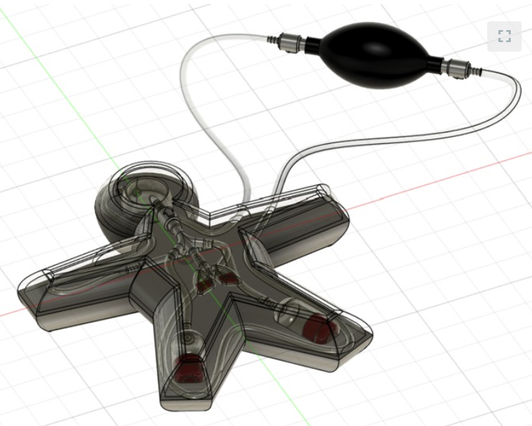
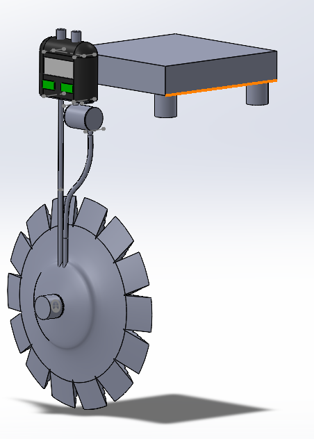

  
Museum of Clinical Systems & Care

  
I use quantitative modeling, device design, and systems thinking to understand biological variability and translate insights into safer, more effective health interventions.

I believe a selfless life will leave you most fulfilled—a consequence, I think, of the principle that you reap what you sow. This starts with people. People are the center to why we do what we do. The relationships we build provide value to our lives.

I have experienced this with my parents and the friendship we have built through sustained effort. I have seen it with the mentees in my organization who now invest their full efforts because they feel valued. I have felt it with friends who help without hesitation and with whom I do the same. I have been thankful to be able to build a community around myself—whether within GRiP, board game nights in my apartment, or through volunteering—and I strive to spread my wings as far as possible within it.

To sustain those relationships and provide meaningful help, I have learned to combine three things: **technical and engineering systems thinking**, **biological and mechanistic insights**, and **genuine personal relationship**. This approach allows me to solve problems at their root cause rather than their surface.

---

## Why This Matters for Medicine

Medicine is fundamentally about people and systems. A clinical decision affects not just a patient's physiology, but their family, their work, their ability to live the life they want. The best interventions are those that acknowledge this complexity—that understand biology, respect constraints, and prioritize continuity and trust.

This portfolio shows some of my efforts in that direction:

- Disease & Treatment Modeling explores how quantitative reasoning can reveal exploitable biology to improve therapeutic strategy.
- Leadership & Service documents how operational infrastructure and clear communication enable reliable care for vulnerable populations.
- Clinical Solutions demonstrate design that begins with clinical constraints and patient behavior, not technical novelty.

These experiences have reinforced that the most important clinical work is often not the most visible. It is showing up consistently, building trust, asking hard questions about what actually helps, and having the humility to say "not yet" when something isn't ready.

That is the kind of physician I want to become.

---

<strong>Gallery Map</strong>
<ul>
  <li><a href="#exhibits">Primary Exhibits</a></li>
  <li><a href="#clinical-solutions">Clinical Solutions</a></li>
  <li><a href="#software-solutions">Software Solutions</a></li>
  <li><a href="#technical">Technical Depth</a></li>
  <li><a href="#leadership">Leadership & Service</a></li>
  <li><a href="#contact">Contact & Links</a></li>
</ul>

<h2 class="section-title">Feature Wall</h2>

  <button type="button" data-wall-prev>&larr; Prev</button>
  <button type="button" data-wall-next>Next &rarr;</button>

  

    
Feature A

    
Disease & Treatment Modeling

    
Interpretable ovarian-cancer dynamics and adaptive-therapy framing for resistant populations.

  

  

    
Feature B

    
VitalIntel — Heart Disease ML

    
Machine-learning workflow for early risk stratification using structured clinical and ECG-related features.

  

  

    
Feature C

    
Health-Focused Data Analysis / ML

    
Interpretability-first analytics with clinically cautious framing and clear model boundaries.

  

  

    
Feature D

    
Rapid Translation & Design Sprints

    
Fast-cycle prototyping under ambiguity with disciplined scope and safety-aware tradeoffs.

  

  

    
Feature E

    
Heart Smart — CHF Education Device

    
Interactive CHF model translating physiology into patient-centered education and adherence support.

  

  

    
Feature F

    
GRiP Bike Prosthetics

    
Led an 8-person team delivering custom bike prosthetics to restore mobility for recipients.

  

  

    
Feature G

    
NeuroVac — SSFS Solution

    
Feedback-controlled pressure modulation concept for sunken skin flap syndrome care.

  

  

    
Feature H

    
Flexi-Foot (Junior Design)

    
Post-op forefoot offloading design balancing pressure relief, stability, and manufacturability.

  

  

    
Feature I

    
Medical Device Development

    
Needs-driven device design with clear constraints, safety priorities, and iteration logic.

  

  

    
Feature J

    
Clinical Solutions

    
Real-world care solutions connecting technical design to deployment and patient outcomes.

  

  

    
Feature K

    
GRiP Admin Platform

    
Operations website with RBAC, attendance approval history, form workflows, and validated data capture.

  

  <section class="exhibit">
    
Exhibit A

    
Disease & Treatment Modeling in Ovarian Cancer

    
Quantitative growth models, adaptive therapy framing, reproducible measurement pipelines.

    

      I built interpretable growth and interaction models to understand resistant vs. sensitive population dynamics and to inform adaptive therapy strategies. The core insight was that resistant populations show stronger density sensitivity, suggesting exploitable competitive asymmetries.
    

    

      <a href="#software-solutions">See Software Solutions</a>
    

  </section>
  <section class="exhibit">
    
Exhibit B

    
Medical Device Development

    
CHF education and communication-focused device design.

    

      This exhibit highlights Heart Smart, a congestive heart failure (CHF) learning device built to help patients visualize disease progression and better understand prevention and treatment decisions.
    

    

      <a href="_projects/heart-smart.md">Open Full CHF Exhibit</a>
    

  </section>
  <section class="exhibit">
    
Exhibit C

    
Clinical Solutions

    
Problem definition, safety constraints, and real-world deployment considerations.

    

      I focus on clinical problems that live between insight and deployable care, emphasizing safety margins, accountability, and workflow fit.
    

    

      <a href="#clinical-solutions">See Clinical Solutions</a>
    

  </section>
  <section class="exhibit">
    
Exhibit D

    
GRiP Bike Devices & Prosthetics

    
Iterative rider-centered design, steering support, and continuity through team handoff.

    

      This work progressed from an initial prosthetic-bike interface model to a more advanced design that addressed increased steering difficulty and control demands. Through iterative CAD and fit-feedback cycles, the team improved geometry, support, and usability so recipients could ride with greater confidence.
    

    

      <a href="_projects/grip-bike-prosthetics.md">Open Full GRiP Exhibit</a>
    

  </section>
  <section class="exhibit">
    
Exhibit E

    
VitalIntel — Heart Disease ML

    
Early diagnostics framing, interpretable modeling, and workflow-aware triage support.

    

      I built and evaluated a heart-disease ML pipeline to support earlier risk identification while preserving clinician oversight and practical triage use.
    

    

      <a href="_projects/vitalintel.md">Open VitalIntel Exhibit</a>
    

  </section>

<h2 id="clinical-solutions" class="section-title">Clinical Solutions</h2>

  

    <strong>Heart Smart — CHF Education Device</strong>
    
Interactive CHF teaching model that lets patients see fluid pooling and feel increased pumping resistance to reinforce prevention and treatment adherence.

    
<a href="_projects/heart-smart.md">Open Heart Smart Exhibit</a>

    
  

  

    <strong>NeuroVac — Sinking Skin Flap Syndrome</strong>
    
Non-invasive pressure and depth-modulating concept for SSFS after decompressive craniectomy, with feedback-controlled regulation and portability focus.

    
<a href="_projects/neurovac.md">Open NeuroVac Exhibit</a>

    
  

  

    <strong>Flexi-Foot — Forefoot Offloading</strong>
    
Post-operative shoe concept balancing offloading and stability, with CAD-driven geometry and material-specific forefoot insole design.

    
<a href="_projects/assistive-prosthetics.md">Open Flexi-Foot Exhibit</a>

    
  

<h2 id="software-solutions" class="section-title">Software Solutions</h2>

  

    <strong>GRiP Admin Platform — Operations Website</strong>
    
Centralized member management, attendance approvals, and form workflows with role-based access and audit-ready history.

    
<a href="_projects/grip-admin-platform.md">Open GRiP Admin Exhibit</a>

  

  

    <strong>Ovarian Cancer Modeling</strong>
    
Multi-compartment models for treatment response and competition dynamics between drug-naïve and resistant populations.

  

  

    <strong>VitalIntel — ML Heart Disease Detection</strong>
    
Risk-prediction workflows integrating preprocessing, feature analysis, and classifier evaluation for earlier clinical escalation.

    
<a href="_projects/vitalintel.md">Open Full VitalIntel Exhibit</a>

  

<h2 id="technical" class="section-title">Technical Depth</h2>

  

    <strong>Device Design Artifacts</strong>
    
Design reports, CAD summaries, and build decisions used to translate ideas into deployable prototypes.

  

  

    <strong>QuPath Cell Count Pipeline</strong>
    
Automated cell counting workflow for large histology datasets with standardized detection, quality control, and structured output export.

    
<a href="_projects/qupath-cell-count-pipeline.md">Open QuPath Pipeline Exhibit</a>

  

  

    <strong>Implementation Tradeoffs</strong>
    
Practical constraints, safety boundaries, and iteration choices documented across project execution.

  

<h2 id="leadership" class="section-title">Leadership & Service</h2>

  

    My leadership has centered on sustained responsibility for people, projects, and continuity. As Vice President of GRiP, I owned project intake,
    continuity infrastructure, and delivery boundaries—balancing growth with safety and transparency for the families we serve.
  

<h2 id="contact" class="section-title">Contact & Links</h2>

  
  

    <strong>Kadin El Bakkouri</strong>
    
Email: <a href="mailto:kelbakkouri@ufl.edu">kelbakkouri@ufl.edu</a> 
    Email (alt): <a href="mailto:elbakkouri.kadin@gmail.com">elbakkouri.kadin@gmail.com</a> 
    Phone: <a href="tel:+14054654320">405-465-4320</a>

    

      LinkedIn: <a href="https://www.linkedin.com/in/kadin-el-bakkouri-09531b289/">kadin-el-bakkouri</a> 
      GitHub: <a href="https://github.com/kadinelbak">kadinelbak</a> 
      MakerWorld: <a href="https://makerworld.com/en/@KadinKreates/upload">KadinKreates</a>
    

    
<a href="../assets/pdf/CV.pdf" download>Download CV (PDF)</a>

  

